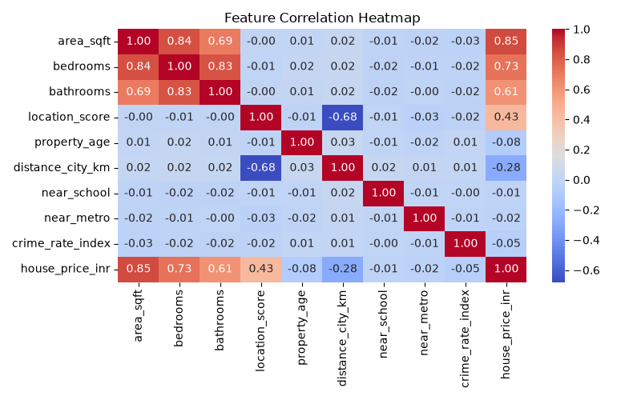
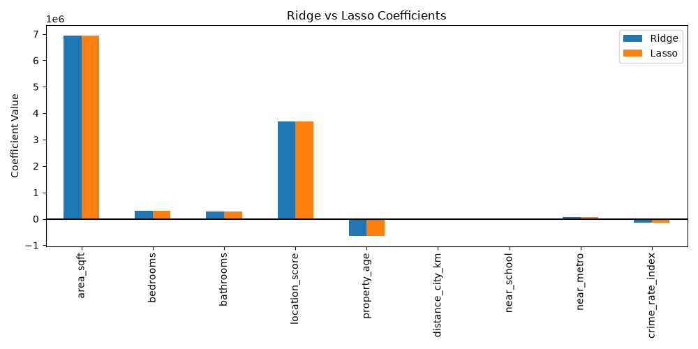
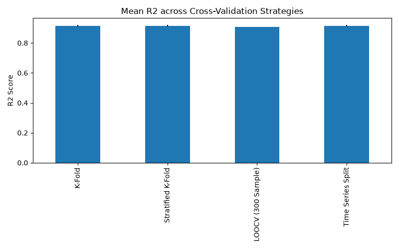

<div align="center">

<a href="https://github.com/RENSEE-GAJIPARA">
  
</a>

<br/>

[](https://www.python.org/)
[](https://scikit-learn.org/)
[](https://streamlit.io/)
[](https://pandas.pydata.org/)
[](https://jupyter.org/)
[](#-results)


</div>

<br/>

## 📖 Table of Contents

- [Overview](#-overview)
- [Live App & Demo](#-live-app--demo)
- [Dataset](#-dataset)
- [Methodology](#-methodology)
- [Results](#-results)
- [Tech Stack](#-tech-stack)
- [Project Structure](#-project-structure)
- [Getting Started](#-getting-started)
- [Theory Document](#-theory-document)
- [Author](#-author)

<br/>

## 🎯 Overview

**Robust Regression Engine** is an end-to-end regression project that predicts **house prices (INR)** from property attributes. It compares regularized linear models, tree-based ensembles, and kernel-based regressors across multiple cross-validation strategies, then ships the winning model inside an interactive **Streamlit** web app.

> 💡 The project doesn't just pick "a model" — it systematically evaluates *why* one model generalizes better than another, backed by a full theory document explaining regularization, bias-variance trade-offs, and cross-validation design.

<br/>

## 🚀 Live App & Demo

<div align="center">

[](#)

</div>

| Resource | Link |
|---|---|
| 🌐 **Streamlit Live App** | `<add your deployed Streamlit app URL here — e.g. https://your-app-name.streamlit.app>` |
| 🎥 **Demo Video** | `<add your walkthrough video URL here — e.g. YouTube / Loom link>` |

<br/>

## 📊 Dataset

The model is trained on a synthetic housing dataset of **3,800 property records** with the following attributes:

| Feature | Description |
|---|---|
| `area_sqft` | Built-up area of the property (sq. ft.) |
| `bedrooms` / `bathrooms` | Room counts |
| `location_score` | Composite location desirability score (1–10) |
| `property_age` | Age of the property (years) |
| `distance_city_km` | Distance from city center (km) |
| `near_school` / `near_metro` | Binary proximity flags |
| `crime_rate_index` | Local crime rate index (0 = safest) |
| `house_price_inr` | **Target** — sale price in INR |

<div align="center">


</div>

<br/>

## 🧪 Methodology

<details open>
<summary><b>1. Exploratory Analysis — Feature Correlation</b></summary>
<br/>

`area_sqft`, `bedrooms`, and `bathrooms` show strong positive correlation with price, while `location_score` correlates positively and `distance_city_km` negatively — matching real-world intuition.


</details>

<details>
<summary><b>2. Regularization — Ridge vs Lasso</b></summary>
<br/>

Both penalize large coefficients, but Lasso's L1 penalty drives weak features to exactly zero, acting as built-in feature selection.


</details>

<details>
<summary><b>3. Cross-Validation Strategy Comparison</b></summary>
<br/>

Evaluated across **K-Fold**, **Stratified K-Fold**, **LOOCV**, and **Time Series Split** to confirm score stability regardless of validation design.


</details>

<details>
<summary><b>4. Tree-Based Models — Decision Tree vs Random Forest</b></summary>
<br/>

Random Forest reduces the train/test R² gap seen in a single Decision Tree, indicating stronger generalization through ensembling.

</details>


<br/>

## 🏆 Results

Six regressors were benchmarked on a held-out test set: **Ridge, Lasso, Decision Tree, Random Forest, SVR (Linear), SVR (RBF)**.


<div align="center">

| Model | Test R² | Relative RMSE |
|---|:---:|:---:|
| 🥇 **Random Forest** | **Highest** | **Lowest** |
| 🥈 Lasso | High | Low |
| 🥉 Ridge | High | Low |
| Decision Tree | Moderate | Moderate |
| SVR (Linear) | Poor | High |
| SVR (RBF) | Poor | High |

</div>

**Winner: Random Forest Regressor** — tuned via cross-validated hyperparameter search (`max_depth=8`, `min_samples_split=5`, `n_estimators=200`) — selected for the smallest train/test R² gap alongside the best absolute score, and deployed as the production model in the Streamlit app.

<br/>

## 🛠️ Tech Stack

<div align="center">


</div>

<br/>

## 📂 Project Structure

```
Robust-Regression-Engine/
├── Notebook
│   └── Robust_Regression_Engine.ipynb     # Full training & evaluation notebook
├── app.py                                 # Streamlit prediction app
├── requirements.txt                       # Python dependencies
├── Dataset
│   └── house_price_dataset.csv            # Source dataset
├── Theory_Document.pdf                    # Concepts write-up (regularization, CV, etc.)
├── Models/
│   └── best_model.pkl                     # Serialized best model bundle
├── Theory_Document.pdf
├── Images/
│   ├── 1_Feature_Correlation_Heatmap.png
│   ├── 2_Ridge_vs_Lasso_Coefficients.png
│   ├── 3_Mean_R2_across_Cross-Validation_Strategies.png
│   ├── 4_Decision_Tree_vs_Random_Forest.png
│   └── 5_Model_Performance_Comparison.png
└── README.md
```

<br/>

## ⚙️ Getting Started

```bash
# 1. Clone the repository
git clone https://github.com/RENSEE-GAJIPARA/Robust-Regression-Engine.git
cd Robust-Regression-Engine

# 2. Install dependencies
pip install -r requirements.txt

# 3. Run the Streamlit app
streamlit run app.py
```

<br/>

## 📘 Theory Document

A companion PDF (`Theory_Document.pdf`) covers the concepts behind the project in depth:

- Regularization (why models need it)
- Ridge (L2) vs Lasso (L1) — mechanics and trade-offs
- Cross-validation strategies: K-Fold, Stratified K-Fold, LOOCV, Time Series Split
- Why tree-based models are scale-invariant
- Final business interpretation of results

<br/>

## 👤 Author

<div align="center">

**RENSEE GAJIPARA**

[](https://github.com/RENSEE-GAJIPARA)
[](https://linkedin.com/in/rensee-gajipara)

<sub>B.Tech in Artificial Intelligence & Data Science · SCET, Surat</sub>

</div>

<br/>

<div align="center">


⭐ **If this project helped you, consider giving it a star!** ⭐

</div>
